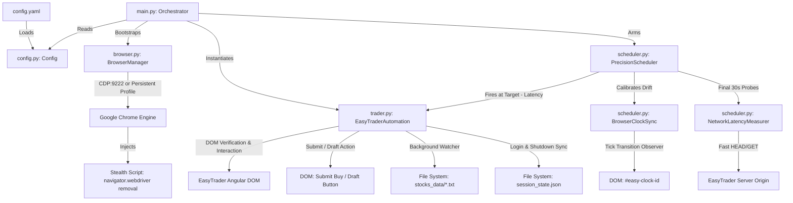

# ARCHITECTURE & SPECIFICATION (TOKEN-OPTIMIZED)

> Compact, high-density system specification. Designed for minimal token consumption by AI agents and developers.

## 1. System Topology Graph



## 2. Module Interfaces & Data Connections

```
[config.yaml]
    │
    ▼ (deserialization via PyYAML)
[config.py: Config] ──(immutable dataclasses)──────────────────────────┐
    │                                                                   │
    ├───────────────┬───────────────────┬──────────────────┐            │
    ▼               ▼                   ▼                  ▼            │
[browser.py]   [scheduler.py]      [trader.py]         [main.py]        │
BrowserManager  PrecisionScheduler  EasyTraderAutomation Orchestrator ──┘
    │               │                   │
    │ (Page/Context)│ (Page/DOM)        │ (Page/DOM)
    ▼               ▼                   ▼
══════════════════ [Chromium Browser Instance: Page] ══════════════════
    │
    ├─► DOM Interaction: Selectors (`data-cy`, IDs, Classes)
    ├─► Server Clock Sync: `#easy-clock-id` (tick delta tracking)
    ├─► Latency Prober: `window.fetch(origin + '/manifest.json')`
    └─► Session Vault: `context.storage_state(path='session_state.json')`
```

### Module Responsibilities & Exports

| Module | Exports | Primary Inputs | Output Artifacts | Target Interconnections |
|---|---|---|---|---|
| `config.py` | `Config`, `AppConfig`, `OrderConfig`, `ScheduleConfig`, `AntiDetectionConfig`, `StorageConfig` | `config.yaml` | Typed Dataclass instances | Imported by `main.py`, `browser.py`, `trader.py`, `scheduler.py` |
| `browser.py` | `BrowserManager`, `find_system_chrome`, `STEALTH_JS` | `Config.app` | `BrowserContext`, `Page` | Auto-detects Chrome binary; handles CDP fallback; injects stealth evasions |
| `scheduler.py`| `PrecisionScheduler`, `BrowserClockSync`, `NetworkLatencyMeasurer` | `ScheduleConfig`, `Page` | Precise firing timestamp | Observes `#easy-clock-id` tick; runs RTT latency probes; executes adaptive busy-wait |
| `trader.py` | `EasyTraderAutomation`, `parse_number` | `Page`, `Config` | `stocks_data/{symbol}.txt`, `session_state.json` | Handles SSO login detection, DOM interaction, symbol watcher, price/volume fill, draft/order execution |
| `main.py` | `main()` | CLI invocation | Application lifecycle | Glues `Config` -> `BrowserManager` -> `EasyTraderAutomation` -> `PrecisionScheduler` |

## 3. DOM Selectors Registry

```
EasyTrader DOM Selectors
├── Authentication & Header
│   ├── [data-cy="symbol-header-symbol-name"]      (Active symbol name in header)
│   ├── [data-cy="order-form-header-symbol-name"] (Active symbol in order drawer)
│   └── symbol-state-icon span[title]             (Trading state: مجاز / متوقف)
├── Live Server Clock
│   ├── #easy-clock-id                            (Primary server clock span)
│   └── [data-cy="order-list-clock"] span         (Fallback server clock span)
├── Daily Limits & Market Depth
│   ├── [data-cy="symbol-detail-candle-max-price"] (Candle daily ceiling price)
│   ├── [data-cy="symbol-detail-candle-min-price"] (Candle daily floor price)
│   ├── [data-cy="symbol-detail-candle-prev-price"](Candle yesterday closing price)
│   ├── [data-cy="symbol-header-last-span"]       (Last executed trade price)
│   ├── [data-cy="symbol-header-closing-price"]   (Closing price)
│   ├── [data-cy="best-buy-limit-price-0"]        (Row 0 best buy queue limit)
│   └── [data-cy="market-depth-aggregates-buy-volume"] (Total buy queue volume)
├── Order Form & Inputs
│   ├── button[data-cy="order-buy-btn"]           (Header Buy button -> opens drawer)
│   ├── [data-cy="order-form-input-quantity"]     (Quantity input field | #quantity)
│   ├── [data-cy="order-form-max-quantity"]       (Max allowable volume quick button)
│   ├── [data-cy="order-form-input-price"]        (Price input field | #price)
│   ├── [data-cy="order-form-max-price"]          (Max ceiling price quick button)
│   └── [data-cy="order-summary-asset"]           (User current owned quantity)
└── Actions & Feedback
    ├── [data-cy="oms-order-form-submit-button-buy"] (Final Send Buy button)
    ├── [data-cy="oms-order-form-draft-button-buy"]  (Save Draft button)
    ├── [data-cy="order-list-container"]          (Order list widget container)
    └── [data-cy="state-notification-alert"]      (Order status error badge: خطا در سفارش)
```

## 4. Execution State Machine

```
[INIT]
  │
  ├─► Auto-configure PLAYWRIGHT_NODEJS_PATH
  ├─► Load & Validate config.yaml
  └─► Initialize BrowserManager (CDP -> Fallback to Persistent Context + Auto-detected Chrome)
  │
[AUTH_CHECK]
  │
  ├─► Check Page URL & Dashboard Elements
  │     ├── In login/OAuth redirect flow? -> Poll & wait for user credentials
  │     └── Dashboard active? -> Dump session_state.json -> Proceed
  │
[RUN_TASKS]
  │
  ├── [BACKGROUND]: Stock Watcher (asyncio.create_task)
  │     └── Polling active symbol -> Writes stocks_data/{symbol}.txt
  │
  └── [FOREGROUND]: Order Preparation
        ├── Check symbol match (skip search if already open)
        ├── Open order drawer
        ├── Populate quantity (Max volume quick button or fixed value)
        └── Populate price (Max ceiling quick button or fixed value)
        │
[SCHEDULE_OR_IMMEDIATE]
  │
  ├── schedule.enabled == false -> Execute immediately
  └── schedule.enabled == true  -> PrecisionScheduler
        ├── Calibrate with #easy-clock-id tick transition (.000ms sync)
        ├── Enter final lookback window (last 30s) -> Measure RTT (Ping)
        ├── Shift target time earlier by one-way latency (RTT / 2)
        └── Adaptive sleep -> 50ms busy-wait loop
        │
[EXECUTE_ACTION]
  │
  ├── action_type == 'draft' -> Click [data-cy='oms-order-form-draft-button-buy']
  └── action_type == 'send'  -> Burst click [data-cy='oms-order-form-submit-button-buy']
  │
[VERIFY & IDLE]
  │
  ├─► Check order-list for alerts
  ├─► Save updated session_state.json on exit
  └─► Keep browser open for inspection
```

## 5. Development Guidelines for Minimal Token Usage

1. **Imports:** Standard modules only (`playwright`, `pyyaml`, `asyncio`, `datetime`).
2. **Selectors:** Always reference the *DOM Selectors Registry* above; avoid querying unfamiliar DOM trees.
3. **Session:** All persistent tokens live in `session_state.json`. Never hardcode authentication.
4. **Timing Calculations:** Time adjustments must always occur through `BrowserClockSync` and `NetworkLatencyMeasurer`.
